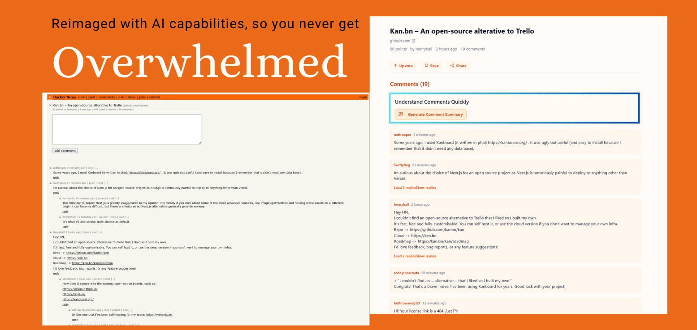
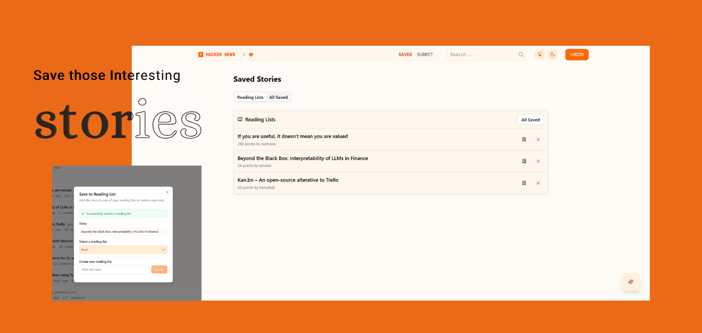
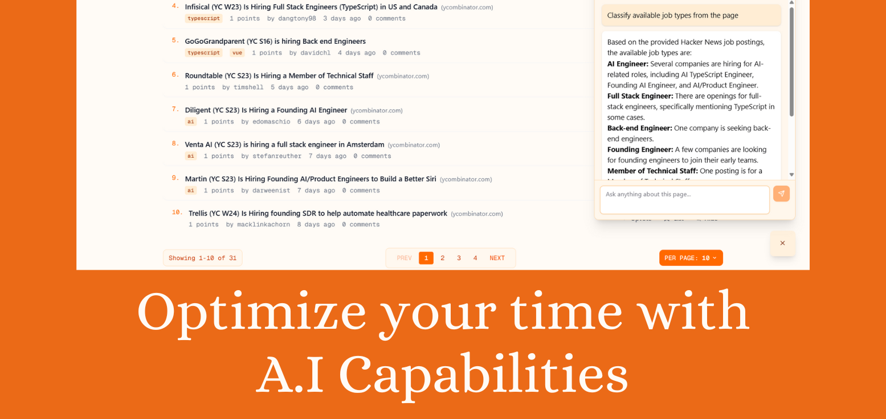

# Hacker News - Rapid Rebuildathon

Try Live: https://hackernews-rebuildathon.vercel.app/    
**Note:** Voice controls only works in edge browser for time being.

A modern, AI-powered rebuild of Hacker News with advanced features including voice control, intelligent summarization, and contextual Q&A capabilities. Built with Next.js 15, TypeScript, and AI integration.

## Screenshots

### Rebuilt - Classic Comparision








## Features

### Voice Control System 
| Note: Only works in edge browser for time being.
- **Speech Recognition**: Navigate and control the app using voice commands
- **Natural Language Processing**: AI-powered command interpretation using Google Gemini
- **Hands-free Navigation**: Browse stories, filter content, and interact without typing
- **Voice Feedback**: Audio responses for better accessibility

### AI-Powered Features
- **Intelligent Summarization**: Get concise summaries of comments and discussions
- **Ask Page Widget**: Context-aware Q&A about current page content
- **AI Command Processing**: Natural language commands for app interaction
- **Content Analysis**: Smart insights and recommendations

### Modern UI/UX
- **Dark/Light Theme**: Seamless theme switching with system preference support
- **Responsive Design**: Optimized for desktop, tablet, and mobile devices
- **Component Library**: Built with shadcn/ui and Radix UI primitives
- **Smooth Animations**: Enhanced user experience with fluid transitions

### Core Hacker News Features
- **Story Browsing**: Top, New, Best, Ask, Show, and Jobs stories
- **Real-time Updates**: Live data from Hacker News Firebase API
- **User Profiles**: Detailed user information and submission history
- **Comments System**: Threaded discussions with collapse/expand functionality
- **Search**: Find stories and discussions across the platform

### Advanced Functionality
- **Reading List**: Save and organize interesting stories
- **Story Filters**: Advanced filtering by type, date, and popularity
- **Pagination**: Efficient content loading with "Load More" functionality

## Usage Guide

### Voice Control
1. **Activate Voice Control**: Click the stars icon in the navbar
2. **Give Commands**: Try saying:
   - "Show me top stories"
   - "Go to ask page"
   - "Switch to dark theme"
   - "Summarize this discussion"

### AI Features
1. **Ask Page Widget**: Click the AI assistant icon to ask questions about current content
2. **Comment Summarization**: Use the summary button on long comment threads
3. **Natural Commands**: Use voice or text to navigate and interact

### Navigation
- **Stories**: Browse different story types via the main navigation
- **Search**: Use the search functionality to find specific content
- **Filters**: Apply filters to customize your story feed
- **Reading List**: Save stories for later reading


## Tech Stack

### Frontend
- **Next.js 15**: React framework with Turbopack for fast development
- **TypeScript**: Type-safe development with full IDE support
- **Tailwind CSS 4**: Utility-first CSS framework
- **shadcn/ui**: High-quality, accessible UI components
- **Radix UI**: Unstyled, accessible components
- **Lucide React**: Beautiful icon library
- **React Hook Form**: Performant forms with validation

### AI Integration
- **Google Gemini API**: Advanced language model (gemini-2.5-flash-preview-04-17)
- **Web Speech API**: Browser-native speech recognition
- **React Markdown**: Rich text rendering with GitHub Flavored Markdown

### State Management & Utilities
- **React Context**: Centralized state for voice control and AI feedback
- **next-themes**: Theme management with SSR support
- **Zod**: Runtime type validation
- **clsx & tailwind-merge**: Conditional styling utilities

### Development Tools
- **ESLint**: Code linting and formatting
- **Jest**: Unit testing framework
- **TypeScript**: Static type checking
- **PostCSS**: CSS processing and optimization

## Getting Started

### Prerequisites
- Node.js 18+ 
- npm or yarn package manager
- Google AI API key (for Gemini integration)

### Installation

1. **Clone the repository**
   ```bash
   git clone <repository-url>
   cd hackernews-rebuildathon
   ```

2. **Install dependencies**
   ```bash
   npm install
   ```

3. **Set up environment variables**
   Create a `.env.local` file in the root directory:
   ```env
   GEMINI_API_KEY=your_google_ai_api_key_here
   ```

4. **Run the development server**
   ```bash
   npm run dev
   ```

5. **Open your browser**
   Navigate to [http://localhost:3000](http://localhost:3000)

### Available Scripts

- `npm run dev` - Start development server with Turbopack
- `npm run build` - Build for production
- `npm run start` - Start production server
- `npm run lint` - Run ESLint
- `npm test` - Run tests
- `npm run test:watch` - Run tests in watch mode

## Project Structure

```
├── src/
│   ├── app/                 # Next.js app router pages
│   │   ├── api/            # API routes for AI integration
│   │   ├── (pages)/        # Application pages
│   │   └── layout.tsx      # Root layout with providers
│   ├── components/         # Reusable UI components
│   │   ├── ui/            # shadcn/ui components
│   │   └── *.tsx          # Feature components
│   ├── context/           # React context providers
│   ├── hooks/             # Custom React hooks
│   ├── lib/               # Utility functions
│   ├── api/               # API services and types
│   └── types/             # TypeScript type definitions
├── theme/                 # Theme provider and components
├── tests/                 # Test files
└── public/               # Static assets
```

## API Integration

### Hacker News API
- **Firebase API**: Real-time data from `https://hacker-news.firebaseio.com/v0/`
- **Story Types**: top, new, best, ask, show, job stories
- **User Data**: Profile information and submission history
- **Comments**: Threaded discussion data

### AI API Routes
- `/api/ai-command` - Process natural language commands
- `/api/ask-page` - Context-aware Q&A functionality  
- `/api/summarize` - Content summarization service

## Theming

The application supports multiple themes:
- **Light Mode**: Clean, bright interface
- **Dark Mode**: Easy on the eyes for night browsing
- **System**: Automatically follows OS preference

Theme switching is handled by `next-themes` with proper SSR support.

## Acknowledgments

- **Hacker News**: For providing the excellent API and inspiration
- **Google AI**: For the powerful Gemini language model
- **Vercel**: For the amazing Next.js framework and deployment
- **shadcn**: For the beautiful UI component library

## Links

- [Hacker News API Documentation](./HNEWS.md)
- [Next.js Documentation](https://nextjs.org/docs)
- [Tailwind CSS](https://tailwindcss.com)
- [shadcn/ui](https://ui.shadcn.com)

---

Built with 🧡
